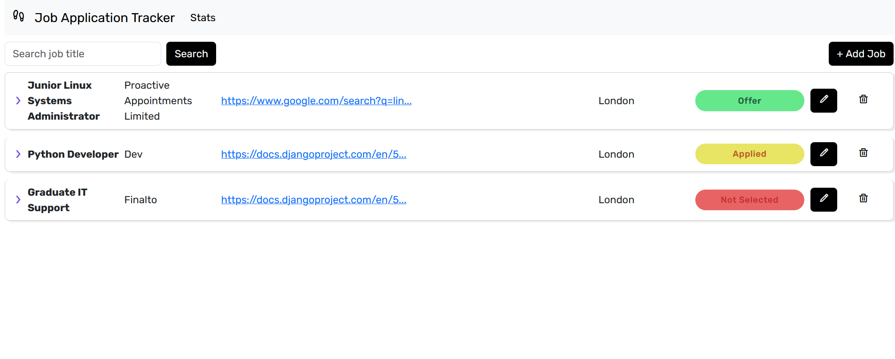
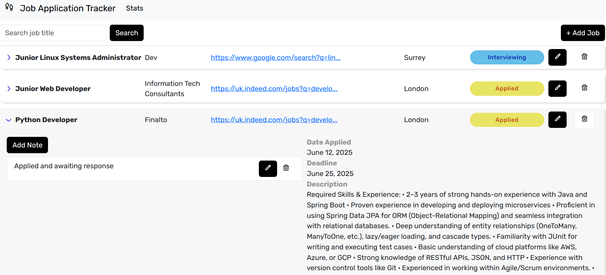
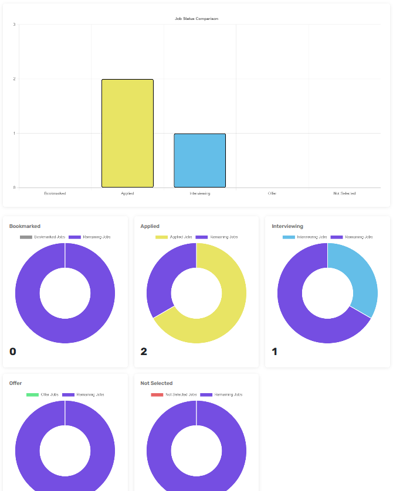

### Contents

- [Preview](#preview)
- [Installation Instructions](#installation-instructions)
- [References](#references)

### Preview





### Installation Instructions

To install the software and use it in your local development environment, you must first set up and activate a local development environment. From the root of the project:

```
$ pip install virtualenv
```

```
$ virtualenv venv
```
This creates a folder venv, where all installed packages will be kept for this project.

Activate it using the command below.

```
$ source venv/bin/activate
```

**Windows**
```
> ./venv/Scripts/activate
```

Once you have activated your virtual environment, install all requirements:
```
 pip install -r requirements.txt
```

Migrate the database:
```
$ python manage.py makemigrations
```
```
$ python3 manage.py migrate
```

Run server:
```
$ python3 manage.py runserver
```

### References

https://docs.djangoproject.com/en/5.2/
https://boxicons.com/